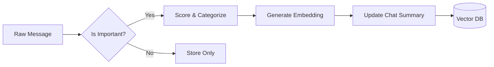

# AI Processing & Semantic Memory Spec

## 1. The Gemini Pipeline

When a message is ingested, it follows this enrichment path:



## 2. Gemini Service Logic (NestJS)

```typescript
@Injectable()
export class GeminiService {
  private model: any;

  constructor(private config: ConfigService) {
    const genAI = new GoogleGenerativeAI(config.get('GEMINI_API_KEY'));
    this.model = genAI.getGenerativeModel({ model: "gemini-pro" });
  }

  async processMessages(batch: string[]) {
    const prompt = `
      Analyze the following Telegram messages. 
      1. Assign an importance score (0-1).
      2. Identify key topics.
      3. Create a concise summary of the interaction.
      
      Messages: ${JSON.stringify(batch)}
    `;
    
    const result = await this.model.generateContent(prompt);
    return JSON.parse(result.response.text());
  }

  async getEmbedding(text: string) {
    const embeddingModel = genAI.getGenerativeModel({ model: "embedding-001" });
    const result = await embeddingModel.embedContent(text);
    return result.embedding.values;
  }
}
```

## 3. Semantic Memory (RAG Strategy)

To answer user questions like *"What did John say about the project deadline?"*:

1. **Query Embedding**: Convert user question to vector using Gemini `embedding-001`.
2. **Vector Search**: Use MongoDB `$vectorSearch` to find top 5 relevant message chunks.
3. **Context Augmentation**: Provide these chunks to Gemini as context.
4. **Final Answer**: Gemini generates the answer based *only* on the provided context.

## 4. Importance Scoring Logic
- **High (0.8+)**: Deadlines, action items, direct mentions of the user, sensitive topics.
- **Medium (0.4-0.7)**: General project updates, social plans.
- **Low (0-0.3)**: Small talk, reactions, bot spam.

## 5. Daily Digest Architecture
- **Trigger**: Cron job at 08:00 AM.
- **Aggregation**: Collect all "High" importance summaries from the last 24 hours.
- **Generation**: One cohesive "Good Morning" brief via Gemini.
- **Delivery**: WebSocket push + Telegram Bot message (if enabled).
