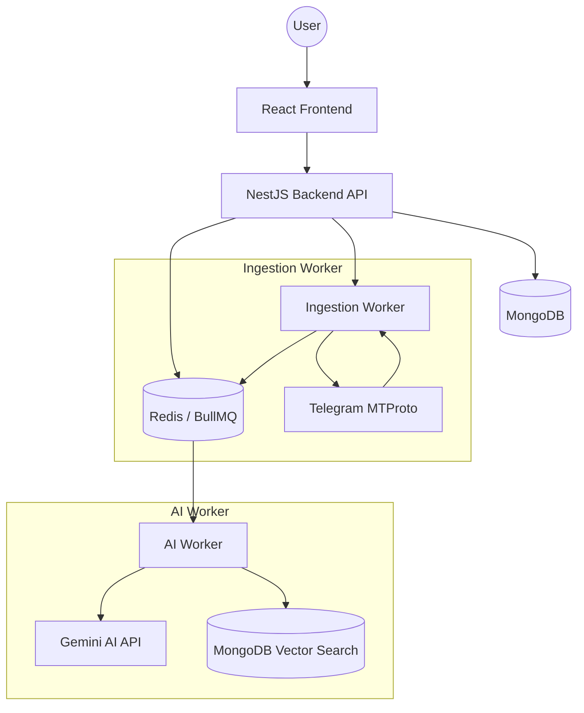

# AI Telegram Second Brain: Production Architecture

This document outlines the complete, production-ready architecture for the AI-powered Telegram Second Brain platform.

## 1. System Overview

The system is designed as a distributed architecture to handle high-concurrency Telegram message ingestion and intensive AI processing asynchronously.



---

## 2. Backend Architecture (NestJS)

### 2.1 Ideal Folder Structure
A domain-driven design (DDD) influenced module structure.

```text
/back
├── src
│   ├── modules
│   │   ├── auth           # Passport, JWT, Registration
│   │   ├── telegram       # MTProto client, Session management, Sync logic
│   │   ├── ingestion      # Message queueing, Deduplication
│   │   ├── ai             # Gemini service, Prompt engineering
│   │   ├── memory         # Semantic memory, Vector search
│   │   ├── summary        # Daily/Weekly digest logic
│   │   ├── notification   # Smart alerts, WebSockets
│   │   └── users          # User profiles, Settings
│   ├── common             # Global guards, filters, decorators
│   ├── config             # Environment variable validation (Zod/Joi)
│   ├── database           # Mongoose schemas & Repositories
│   ├── queues             # BullMQ processor definitions
│   └── main.ts
├── test                   # E2E & Unit tests
├── docker-compose.yml
└── Dockerfile
```

### 2.2 Module Architecture
Each module is encapsulated. For example, the `TelegramModule` exports a `TelegramService` but hides the complex MTProto lifecycle.

### 2.3 MongoDB Schema Design

#### User Schema
```typescript
{
  email: { type: String, unique: true },
  password: { type: String, select: false },
  telegramId: { type: String, index: true },
  tgSession: { type: String }, // Encrypted String
  settings: {
    syncEnabled: Boolean,
    digestFrequency: String, // 'daily', 'weekly'
  }
}
```

#### Message Schema
```typescript
{
  userId: ObjectId,
  tgMessageId: Number,
  chatId: String,
  content: String,
  timestamp: Date,
  metadata: {
    senderId: String,
    senderName: String,
    isBot: Boolean,
  },
  aiMetadata: {
    importanceScore: Number, // 0-1
    summary: String,
    embedding: [Number], // Vector for semantic search
    topics: [String],
  }
}
```

### 2.4 Telegram MTProto Integration & Session Handling
- **Strategy**: Store the `stringSession` from GramJS in MongoDB, **encrypted** using a `SESSION_SECRET`.
- **Concurrency**: Use a Singleton pattern per user session in the Ingestion Worker. 
- **Disconnects**: Automatically reconnect on worker restart using stored sessions.

### 2.5 AI Processing Pipeline (Asynchronous)
1. **Ingestion**: Message received -> Push to `message-processing` queue.
2. **Worker**:
   - Batch 10-20 messages to reduce Gemini API calls (cost optimization).
   - Generate summary and importance score.
   - Generate embeddings for semantic search.
   - Store results back in MongoDB.

---

## 3. Frontend Architecture (React + Vite)

### 3.1 Feature-Based Structure
```text
/front/src
├── assets
├── components         # Shared UI components (Atomic Design)
├── features
│   ├── auth           # Login/Register components & logic
│   ├── telegram       # Connection flow (Phone, Code, 2FA)
│   ├── chat           # AI Search & Chat interface
│   ├── dashboard      # Metrics & Recent summaries
│   └── settings       # User preferences
├── hooks              # Custom React hooks (useAuth, useSocket)
├── services           # Axios instances, API endpoints
├── store              # Zustand state (Auth, UI, SyncStatus)
├── theme              # Tailwind config, Global styles
└── types              # TypeScript interfaces
```

### 3.2 Telegram Connect Flow UI
- **Step 1**: Input Phone Number.
- **Step 2**: Receive code via Telegram -> Enter in UI.
- **Step 3**: (Optional) 2FA Password input.
- **State**: Use a multi-step form with loading skeletons during MTProto handshake.

### 3.3 State Management (Zustand)
Why? Lightweight, no boilerplate, perfect for this scale.
- `useAuthStore`: Handles tokens and user profile.
- `useSyncStore`: Tracks real-time ingestion status via WebSockets.

---

## 4. Key Strategies

### 4.1 Security Strategy
- **AES-256 Encryption**: All Telegram session strings must be encrypted before database storage.
- **Rate Limiting**: Throttling on Auth and Telegram connection endpoints.
- **JWT**: Stateless authentication with short-lived tokens and refresh tokens.

### 4.2 Gemini API Cost Optimization
- **Batching**: Grouping non-urgent messages for processing.
- **Caching**: Store embeddings in MongoDB. If a user asks a similar question, use vector search first before hitting the LLM.
- **Filtering**: Only process "important" chats (ignore bot commands, spam).

### 4.3 Semantic Search
- Use **MongoDB Vector Search** (Atlas) or **Pinecone/Milvus**.
- Workflow: User Search -> Generate Search Embedding -> Vector Match -> AI RAG (Retrieval Augmented Generation) -> Final Answer.

---

## 5. Deployment & Scalability
- **Docker Compose**: Orchestrate Backend, Frontend, MongoDB, and Redis.
- **Horizonal Scaling**: Workers (Ingestion/AI) can be scaled independently of the API.
- **Future-Proofing**: The `IngestionService` is an interface. Adding `DiscordIngestionService` or `WhatsAppIngestionService` requires zero changes to the AI pipeline.

## 6. Next Steps Implementation Order
1. **Infrastructure**: Set up Docker with MongoDB and Redis.
2. **Core Backend**: Implement Auth and encrypted User storage.
3. **Telegram Handshake**: Build the MTProto connection flow.
4. **Ingestion Engine**: Set up BullMQ and basic message storage.
5. **AI Pipeline**: Integrate Gemini for importance/summaries.
6. **Frontend**: Build the dashboard and search UI.
