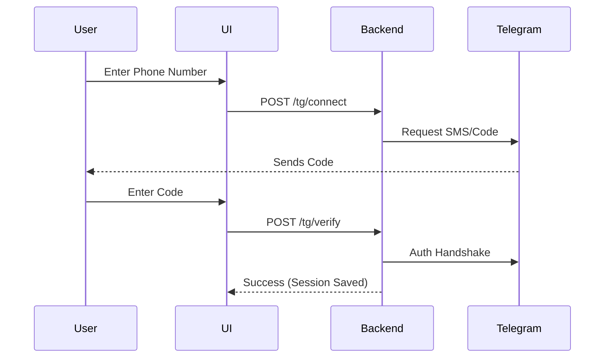

# Frontend Technical Specification (React + Vite)

## 1. Feature-Based Organization

Each feature folder in `src/features/` contains its own components, hooks, and services.

### Example: `src/features/chat/`
- `components/SearchInput.tsx`
- `components/MessageList.tsx`
- `hooks/useSemanticSearch.ts`
- `services/chatApi.ts`
- `index.ts` (Exporting public API of the feature)

## 2. Authentication Strategy
- **Persistence**: Store JWT in `localStorage` or `httpOnly` cookies.
- **Axios Interceptor**: Automatically attach `Authorization: Bearer <token>` to all requests.
- **Refresh Logic**: If a `401` is received, attempt to hit `/auth/refresh` before failing.

## 3. Telegram Connect UI Flow



## 4. State Management (Zustand)

```typescript
// src/store/useAuthStore.ts
import { create } from 'zustand';

interface AuthState {
  user: any | null;
  token: string | null;
  setAuth: (user: any, token: string) => void;
  logout: () => void;
}

export const useAuthStore = create<AuthState>((set) => ({
  user: null,
  token: null,
  setAuth: (user, token) => set({ user, token }),
  logout: () => set({ user: null, token: null }),
}));
```

## 5. UI/UX Aesthetics
- **Framework**: TailwindCSS.
- **Icons**: Lucide React.
- **Animations**: Framer Motion for smooth transitions between dashboard views.
- **Color Palette**: 
  - Dark Mode: Background `#0f172a`, Primary `#3b82f6` (Blue), Accent `#8b5cf6` (Violet).
  - Glassmorphism for sidebars and overlays (`backdrop-blur-md`).

## 6. Real-time Communication
- **Socket.io-client**: Connected to the backend Gateway.
- **Usage**: 
  - Updating the "Syncing messages..." progress bar.
  - Toast notifications for daily summaries ready.
  - Live AI "typing" indicators during search.

## 7. Component Organization
- `src/components/ui/`: Atomic components (Button, Input, Card).
- `src/components/layout/`: Shell, Sidebar, Navbar.
- `src/features/*/components/`: Feature-specific organisms.
